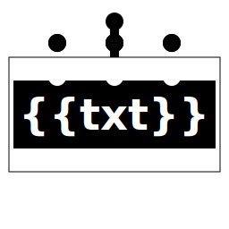
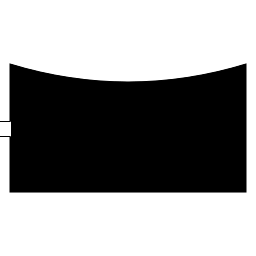

# Führungsharke
Unter [fuehrungsharke.github.io](https://fuehrungsharke.github.io/) kann eine eigene Führungsharke erstellt werden.

## Konfiguration
Die Struktur der Führungsharke kann als `*.json`-Datei gespeichert und auch wieder geladen werden. In diesem Abschnitt ist der Aufbau der `*.json`-Datei dokumentiert.

### Beispiel:
```
{
	"func": "Flag",
	"sub": [
		{
			"func": "Unit",
			"txt": "TZ-R",
			"org": "THW",
			"name": "OV A-Stadt",
			"attr": "platoon",
			"sub": [
				{
					"func": "Person",
					"attr": "platoon",
					"txt": "TZ",
					"name": "Frau Musterfrau"
				}
			]
		},
		{
			"func": "Unit",
			"txt": "N",
			"org": "THW",
			"name": "OV B-Dorf",
			"attr": "group",
			"sub": [
				{
					"func": "Person",
					"attr": "group, leading",
					"txt": "TZ",
					"name": "Herr Mustermann"
				}
			]
		}
	]
}
```

### `func`
Gibt die Grundform an.
Die Grundform kann durch weitere Parameter angepasst werden.
| value | Zeichen |
| --- | --- |
| `Unit` |  |
| `Vehicle` |  |
| `Trailer` |  |
| `Bike` |  |
| `Person` |  |
| `Flag` |  |
| `Empty` | <br>\[Platzhalter\] |

### `txt`
Gibt den Text in dem taktischen Zeichen an.

### `org`
Gibt die Organisation in oder am taktischen Zeichen an.

### `name`
Freitext unterhalb des taktischen Zeichens.

### `attr`
Bietet je nach Grundform weitere Optionen an.
Mehrere Attribute können durch Komma getrennt angegeben werden.
| value | Bedeutung | Verfügbar für |
| --- | --- | --- |
| formation | Verband | `Unit`, `Person` |
| platoon | Zug | `Unit`, `Person` |
| ofplatoon | Zugtrupp | `Unit`, `Person` |
| echelon | Staffel | `Unit` |
| group | Gruppe | `Unit`, `Person` |
| troop | Trupp | `Unit`, `Person` |
| leading | Führungsfunktion | `Unit`, `Person` |
| support | Bereitstellungsfunktion | `Unit` |
| specialist | Besondere Funktion | `Person` |
| offroad | Geländegängig | `Vehicle` |

### `sub`
Liste von untergeordneten taktischen Zeichen (Objekte). Untergeordnete Objekte, die selbst wiederum untergeordnete Objekte haben, werden zu ihren übergeordneten Objekten mit einer Linie verbunden.<br>
Alle untergeordneten Objekte, denen selbst keine weiteren Objekte untergeordnet sind, werden ohne Line zum übergeordnetem Objekt angezeigt.

### `with`
Weitere taktische Zeichen, die neben dem taktische Zeichen angezeigt werden sollen, aber nicht untergeordnet sind. Zum Beispiel taktisches Zeichen der Einheit mit (`with`) dem taktischen Zeichen der Führungsperson und/oder dem Fahrzeug bzw. den Fahrzeugen.