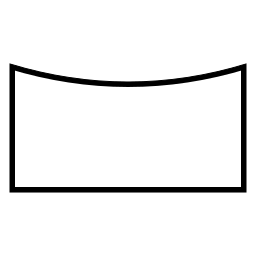
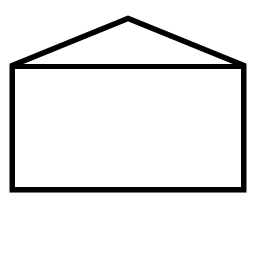
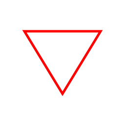
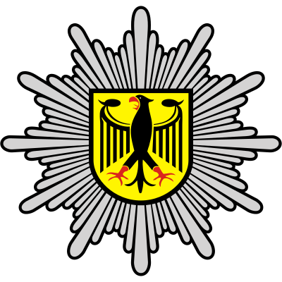

# Führungsharke
Unter [fuehrungsharke.github.io](https://fuehrungsharke.github.io/) kann eine eigene Führungsharke erstellt werden. Diese kann als Vektorgrafik (`*.svg`) heruntergeladen werden.

## Konfiguration
Die Struktur der Führungsharke kann als `*.json`-Datei gespeichert und auch wieder geladen werden.

Folgende Grundzeichen können in der Führungsharke konfiguriert und über das Kontextmenü modifiziert werden:
| Bedeutung | Zeichen |
| --- | --- |
| Einheit |  |
| Person |  |
| Fahrzeug |  |
| Befehlsstelle |  |
| Gebäude |  |
| Gefahr |  |
| Maßnahme |  |
| Stelle |  |
| Zweirad |  |
| Platzhalter |  \[Platzhalter\] |

## Bildnachweise
| Bild | Quelle | Lizenz |
| --- | --- | --- |
|  | https://de.wikipedia.org/wiki/Datei:Bundespolizei-Logos.svg | Gemeinfrei |
|  | https://de.wikipedia.org/wiki/Datei:Logo_of_the_Bundeswehr.svg | Gemeinfrei |
|  | https://de.wikipedia.org/wiki/Datei:THW.svg | Gemeinfrei |