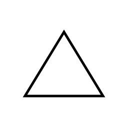

# Führungsharke
Unter [fuehrungsharke.github.io](https://fuehrungsharke.github.io/) kann eine eigene Führungsharke erstellt werden. Diese kann als Vektorgrafik (`*.svg`) heruntergeladen werden.

## Beispiele

### Technischer Zug mit Bergungsgruppe und Fachgruppe Notversorgung / Notinstandsetzung

## Konfiguration
Die Struktur der Führungsharke kann als `*.json`-Datei gespeichert und auch wieder geladen werden.

Folgende Grundzeichen können in der Führungsharke konfiguriert und über das Kontextmenü modifiziert werden:
| Bedeutung | Zeichen |
| --- | --- |
| Einheit |  |
| Person |  |
| Fahrzeug |  |
| Befehlsstelle |  |
| Gebäude |  |
| Gefahr |  |
| Maßnahme |  |
| Stelle |  |
| Zweirad |  |
| Boot |  |
| Platzhalter |  \[Platzhalter\] |

## Bildnachweise
| Bild | Quelle | Lizenz |
| --- | --- | --- |
|  | https://de.wikipedia.org/wiki/Datei:Bundespolizei-Logos.svg | Gemeinfrei |
|  | https://de.wikipedia.org/wiki/Datei:Logo_of_the_Bundeswehr.svg | Gemeinfrei |
|  | https://de.wikipedia.org/wiki/Datei:THW.svg | Gemeinfrei |
|  | https://fonts.google.com/icons | [Creative Commons](https://creativecommons.org/licenses/by-sa/4.0/) |

# How to run
Für die lokale Entwicklung kann auf Docker zurückgegriffen werden. Dazu muss Docker auf dem System installiert sein (siehe [Offizielle Dokumentation](https://docs.docker.com/engine/install/))

Wenn Docker auf dem Host installiert ist, genügt es folgende Dockerbefehle auszuführen:

<code>docker build . -t fuehrungsharke</code> - Baut das Docker Image lokal unter dem Namen "fuehrungsharke"

<code>docker run --name fuehark --rm -p 8080:3000 fuehrungsharke</code> - Erstellt den Container, führt ihn aus und ermöglicht den Zugriff auf die Applikation auf "localhost:8080". Durch STRG+C kann die Ausführung gestoptt und der Container gelöscht werden.
